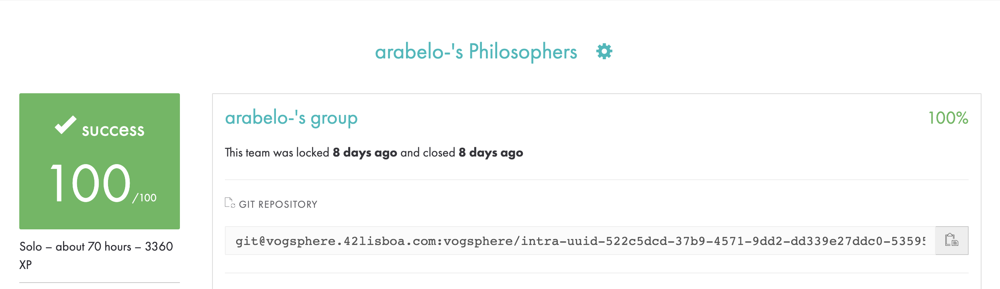

# Português 🇧🇷🇵🇹

<details>
  <summary>
    Saiba mais
  </summary>
  
  # Philosophers
Projeto da [42](https://www.42lisboa.com) - Rank 3 - Philosophers

<details>
  <summary><strong>🏆 Meu desempenho</strong></summary><br />

  
</details>

## 📌 Habilidades

> Habilidades desenvolvidas:

- Entendimento sobre threads
- Entendimento sobre mutex
- Fluxo de execução
- Sincronização de threads

## ‍💻 Softwares necessários

- C compiler (clang)
- GNU make
- mlx (Minilibx/42[Library])

## ⬇️ Compilando arquivos

```bash
	make #Compila o executável 'philo'.
	make all #Faz exatamente a mesma coisa que apenas 'make'.
	make philo #Faz exatamente a mesma coisa que apenas 'make'.
```

## ⚡ Testando o projeto

```
	Para testar este projeto é necessário executar o binário 'philo' com os argumentos necessários. Exemplo: ./philo 5 800 200 200
	PS: Este projeto foi desenvolvido para rodar em sistemas operacionais Linux e MacOS.
```

## Time de desenvolvimento

> Projeto individual:

<table>
    <tr>
      <td>
        
        <h4 align="center">Alê Rabelo</h4>
      </td>
    </tr>
  </table>

## 💬 Contatos

<div align="center" style="display: inline_block">
  <a href="https://www.linkedin.com/in/al%C3%AA-emmanuel-rabelo-guedes/" target="_blank">
    
  </a> 
   <a href="mailto:rabeloguedes@proton.me">
     
  </a>
</div>

</details>

# English 🇺🇸🇬🇧

<details>
  <summary>
    More
  </summary>
  
  # Philosophers
Project from [42](https://www.42lisboa.com/) - Rank 3 - Philo

<details>
  <summary><strong>🏆 My accomplishment</strong></summary><br />

  

</details>

## 📌 Skills

> Practiced skills:

- Understanding about threads
- Understanding about mutex
- Flow of execution
- Threads synchronization

## ‍💻 Required Softwares

- C compiler (clang)
- GNU make

## ⬇️ Compiling files

```bash
	make #Compile the executable 'philo'.
	make all #Do exactly what the above command does.
	make philo #Do exactly what the above command does.
```

## ⚡ Testing the project

```
	To test this project, it is necessary to execute the binary 'philo' with the necessary arguments. Example: ./philo 5 800 200 200
	PS: This project was developed to run on Linux and Mac operating systems.
```

## Squad

> Single person project:

<table>
    <tr>
      <td>
        
        <h4 align="center">Alê Rabelo</h4>
      </td>
    </tr>
  </table>

## 💬 Contact

<div align="center" style="display: inline_block">
  <a href="https://www.linkedin.com/in/al%C3%AA-emmanuel-rabelo-guedes/" target="_blank">
    
  </a> 
   <a href="mailto:rabeloguedes@proton.me">
     
  </a>
</div>

</details>

# Deutsch 🇩🇪

<details>
  <summary>
    Mehr
  </summary>
  
  # Philosophers
Projekt von [42](https://www.42lisboa.com/) - Rank 3 - Philo

<details>
  <summary><strong>🏆 Meine Leistung</strong></summary><br />

  
</details>

## 📌 Fähigkeiten

> Ausgeübte Fähigkeiten:

- Verständnis über Threads
- Verständnis über Mutex
- Ausführungsfluss
- Threads Synchronisation

## ‍💻 Benötigte Software

- C compiler (clang)
- GNU make

## ⬇️ Dateien zusammenstellen

```bash
	make #Kompilieren die philo binäre Datei.
	make all #Machen Sie genau das aus, was der obige Befehl bewirkt.
	make philo #Machen Sie genau das, was der obige Befehl bewirkt.
```

## ⚡ Projekt Testing

```
	Zum Testen dieses Projekts ist es erforderlich, die Binärdatei 'philo' mit den erforderlichen Argumenten auszuführen. Beispiel: ./philo 5 800 200 200
	PS: Dieses Projekt wurde für Linux-Betriebssysteme entwickelt.
```

## Entwickungsteam

> Einzelperson Projekt:

  <table>
    <tr>
      <td>
        
        <h4 align="center">Alê Rabelo</h4>
      </td>
  </table>

## 💬 Kontakt

<div align="center" style="display: inline_block">
  <a href="https://www.linkedin.com/in/al%C3%AA-emmanuel-rabelo-guedes/" target="_blank">
    
  </a> 
   <a href="mailto:rabeloguedes@proton.me">
     
  </a>
</div>

</details>
